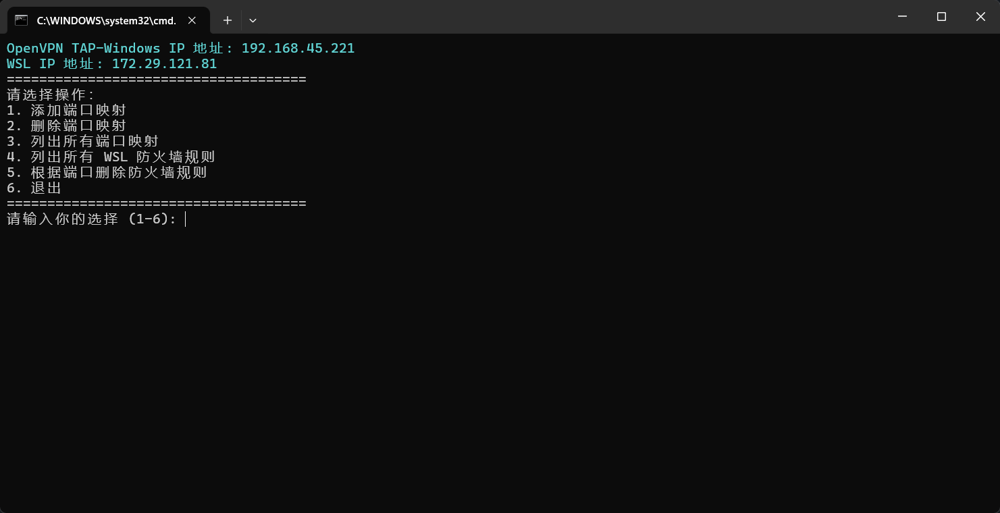

# wslp2l
wsl port to localhost

## 开篇

我在做offsec课程lab的时候，总是需要启动Kali虚拟机，每次的话就特别麻烦。但有的操作不需要在Kali Linux当中完成。

所以就想到了使用 `基于Windows的Linux子系统(wsl)` 来安装KaliLinux，然后通过rdp连接KaliLinux

该脚本是配合上面的方法使用。将openvpn的流量转发到本地

添加和删除都只需要输入端口即可完成端口映射的添加删除操作

## 展示
> [!NOTE]
>该脚本需要使用powershell 7.4 及以上的版本运行
>

- 下载地址: [在 Windows 上安装 PowerShell - PowerShell | Microsoft Learn](https://learn.microsoft.com/zh-cn/powershell/scripting/install/installing-powershell-on-windows?view=powershell-7.4)

> [!NOTE]
>该脚本需要使用到sudo for Windows 来执行bypassuac授权操作
>

- 下载地址: [sudo for windows](https://github.com/gerardog/gsudo)

---

